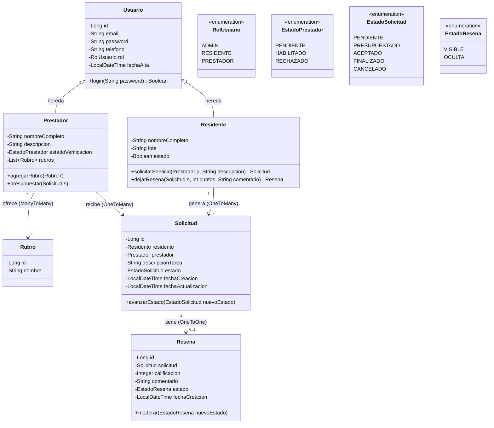

# Diagrama de Clases (UML) - Vecindapp

Este diagrama representa el modelo de dominio orientado a objetos para el backend en Spring Boot.
A partir de acá se va a modificar y versionar, una vez completo se exporta a imagen o PDF.

