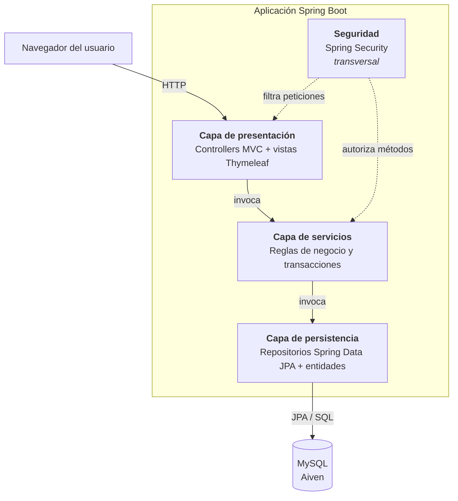
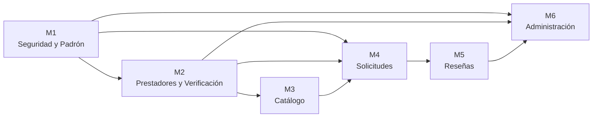
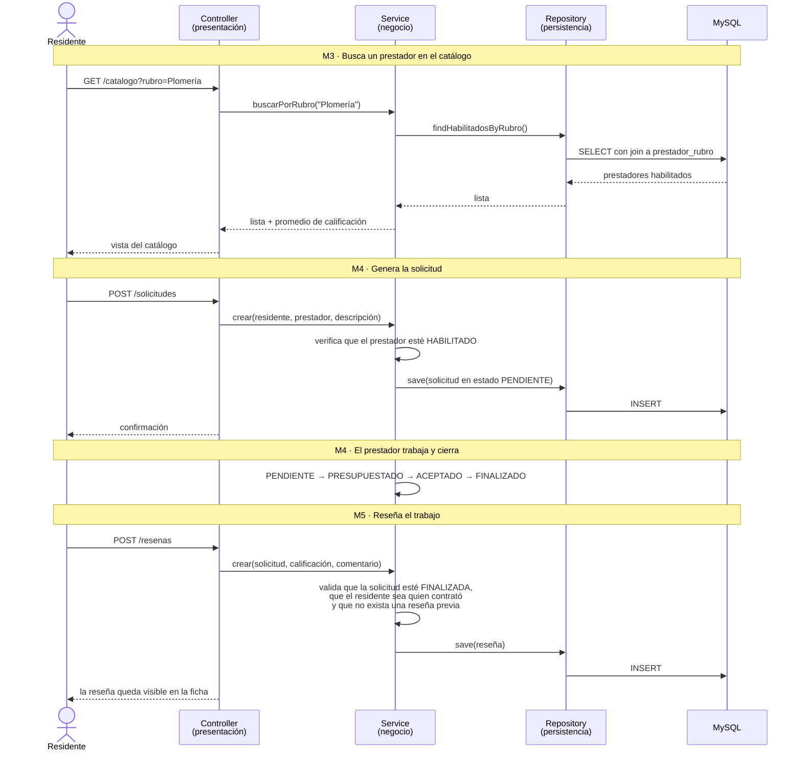
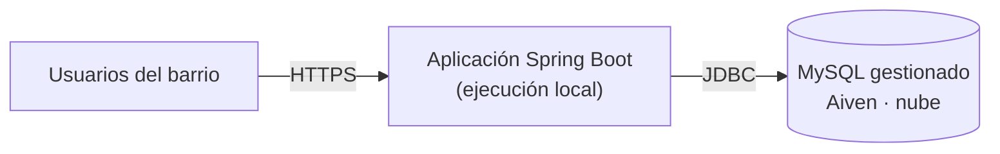

# Arquitectura de la aplicación

Este documento describe cómo está organizada internamente la aplicación: su estilo
arquitectónico, las capas que la componen, qué responsabilidad tiene cada una y cómo se
estructura el código.

La justificación de por qué se eligió esta arquitectura, con las alternativas evaluadas, está
en la [decisión 010](decisiones/010-arquitectura-en-capas.md).

---

## 1. Estilo arquitectónico

**Vecindapp es una aplicación monolítica organizada en capas, con el patrón MVC en la capa de
presentación.**

- **Monolítica**: un único proceso desplegable que contiene toda la lógica. No hay servicios
  independientes ni comunicación por red entre componentes internos.
- **En capas**: el código se divide en niveles horizontales con responsabilidades separadas, y
  cada nivel solo puede invocar al inmediatamente inferior.
- **MVC en la presentación**: las peticiones HTTP las atiende un controlador, que prepara un
  modelo y delega el renderizado en una vista Thymeleaf.

---

## 2. Las capas



**Regla de dependencia.** Cada capa conoce únicamente a la que tiene debajo. Un controlador
nunca accede a un repositorio de forma directa, y un repositorio nunca invoca a un servicio.
Esta regla es lo que mantiene la separación: si se rompe, la arquitectura en capas deja de
existir aunque los paquetes sigan ahí.

---

## 3. Responsabilidades

| Capa | Qué hace | Qué **no** hace |
|---|---|---|
| **Presentación** | Recibe la petición HTTP, valida el formato de la entrada, arma el modelo y elige la vista. Traduce excepciones del negocio en mensajes para el usuario | No contiene reglas de negocio ni consultas a la base |
| **Servicios** | Aplica las reglas de negocio, coordina varios repositorios, delimita las transacciones | No conoce HTTP: no maneja peticiones, sesiones ni vistas |
| **Persistencia** | Lee y escribe entidades. Consultas derivadas de Spring Data y consultas propias cuando hace falta | No decide nada del negocio |
| **Seguridad** | Autenticación, autorización por rol en rutas y métodos, hash de contraseñas | No implementa reglas propias del dominio |

**Dónde vive cada tipo de validación.** Es la distinción que más confusión genera, así que
queda explícita:

| Tipo | Ejemplo | Dónde |
|---|---|---|
| Formato de la entrada | El email tiene forma de email; la calificación es un entero | Presentación (Bean Validation) |
| Permiso de acceso | Solo un `ADMIN` entra al panel de administración | Seguridad |
| Regla de negocio | Solo el residente que contrató puede reseñar, y solo si la solicitud está `FINALIZADA` | Servicios |
| Integridad de los datos | Una reseña no puede existir sin su solicitud | Base de datos (claves foráneas y restricciones) |

Las reglas de negocio se validan **en la capa de servicios y no en el navegador**: el cliente
está bajo control del usuario y cualquier validación que viva solo ahí puede saltearse.

---

## 4. Organización del código

Los paquetes se organizan **por capa**. Dentro de cada capa, las clases se nombran según el
módulo al que pertenecen, de modo que los módulos definidos en [`modulos.md`](modulos.md)
siguen siendo identificables.

```
com.vecindapp
├── config          Configuración de Spring y de seguridad
├── controller      Controladores MVC             (capa de presentación)
├── service         Lógica de negocio             (capa de servicios)
├── repository      Repositorios Spring Data JPA  (capa de persistencia)
├── entity          Entidades JPA
├── enums           Enumeraciones del dominio
└── exception       Excepciones propias y manejo centralizado de errores

src/main/resources
├── templates       Vistas Thymeleaf
└── static          CSS, JavaScript e imágenes
```

**Correspondencia entre módulos y clases.** Cada módulo atraviesa las tres capas:

| Módulo | Controller | Service | Repository |
|---|---|---|---|
| M1 · Seguridad y Padrón | `UsuarioController`, `ResidenteController` | `UsuarioService`, `ResidenteService` | `UsuarioRepository`, `ResidenteRepository` |
| M2 · Prestadores y Verificación | `PrestadorController` | `PrestadorService` | `PrestadorRepository`, `RubroRepository` |
| M3 · Catálogo | `CatalogoController` | `CatalogoService` | `PrestadorRepository` |
| M4 · Solicitudes | `SolicitudController` | `SolicitudService` | `SolicitudRepository` |
| M5 · Reseñas | `ResenaController` | `ResenaService` | `ResenaRepository` |
| M6 · Administración | `AdminController` | `AdminService`, `ModeracionService` | varios, en modo consulta |

---

## 5. Dependencias entre módulos

Un módulo depende de otro cuando necesita sus servicios o sus entidades para funcionar. El
orden de desarrollo sigue esta cadena.



M1 no depende de nadie y por eso se construye primero. M6 depende de casi todos y por eso es
el último y el primero en recortarse si el cronograma se atrasa.

---

## 6. Flujo crítico: contratar un servicio y reseñarlo

Es el recorrido que da sentido al sistema. Si este flujo funciona de punta a punta, el
producto cumple su propósito. El diagrama muestra cómo se encadenan los módulos y cómo
atraviesa cada petición las capas.



Las tres validaciones del último paso viven en la capa de servicios, no en el formulario.

---

## 7. Componentes transversales

**Seguridad.** Spring Security actúa en dos niveles: un filtro que intercepta cada petición
antes de llegar al controlador, y anotaciones sobre los métodos de servicio para las reglas que
dependen del rol. El acceso al catálogo exige pertenecer al padrón de residentes, y esa
comprobación se resuelve del lado del servidor.

**Manejo de errores.** Un manejador centralizado traduce las excepciones del dominio en
páginas de error con un mensaje comprensible, en lugar de exponer trazas al usuario.

**Transacciones.** Se delimitan en la capa de servicios. Una operación que toca varias tablas
—crear una solicitud y actualizar el estado del prestador, por ejemplo— ocurre completa o no
ocurre.

---

## 8. Despliegue



La base de datos corre en un servicio gestionado en la nube; la aplicación se ejecuta
localmente. El detalle y los motivos están en la
[decisión 007](decisiones/007-nube-solo-base-de-datos.md).
